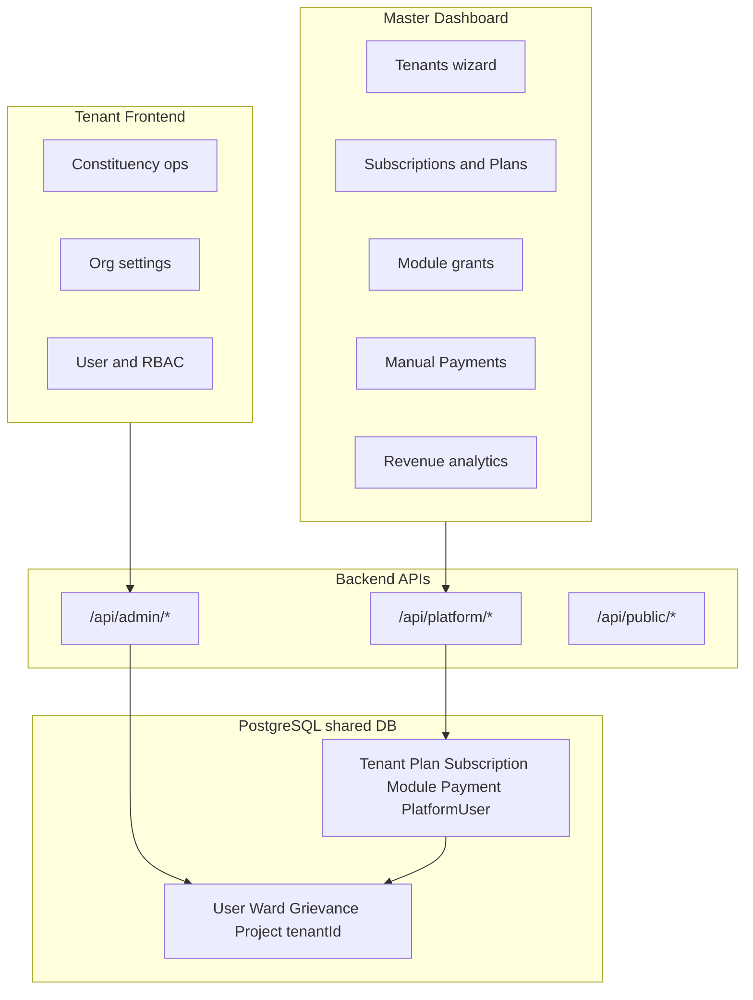
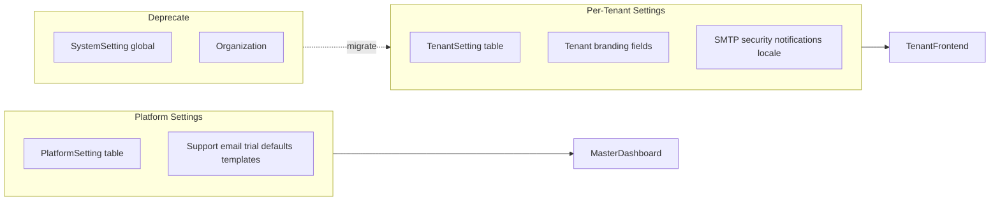

# Complete SaaS Platform Analysis & Roadmap

## Current Architecture

| Layer | Path | Role |
|-------|------|------|
| Platform UI | [master-dashboard/](master-dashboard/) | Operator console: tenants, plans, subs, modules, manual payments |
| Tenant UI | [frontend/](frontend/) | Constituency management portal per tenant |
| Platform API | [backend/src/routes/platform/](backend/src/routes/platform/) | SaaS control plane |
| Tenant API | [backend/src/routes/admin/](backend/src/routes/admin/) | Tenant-scoped operations |
| Schema | [backend/prisma/schema.prisma](backend/prisma/schema.prisma) | Full SaaS data model |

---

## What Is Already Built (Strong Foundation)

### Backend — Platform (Master Dashboard API)

| Area | Status | Key files |
|------|--------|-----------|
| Tenant lifecycle | Done | [tenants.controller.ts](backend/src/controllers/platform/tenants.controller.ts) — create with admin user, subscription, default settings, all modules |
| Subscription plans | Done | [subscriptions.controller.ts](backend/src/controllers/platform/subscriptions.controller.ts) — CRUD, upgrade/suspend/cancel, MRR/ARR/churn |
| Manual payments/invoices | Done | [payments.controller.ts](backend/src/controllers/platform/payments.controller.ts) — `Payment` doubles as invoice; auto `INV-YYYYMMDD-XXXX`; reduces `amountDue` on SUCCESS |
| Module catalog + grants | Done | [modules.controller.ts](backend/src/controllers/platform/modules.controller.ts) — per-tenant grant/revoke/bulk |
| Platform analytics | Done | [dashboard.controller.ts](backend/src/controllers/platform/dashboard.controller.ts) |
| Platform auth | Done | Separate `PlatformUser` + JWT `accountType=platform` |

### Backend — Tenant Isolation

- Row-level `tenantId` on ~20 domain models
- JWT carries `tenantId`; routes use `requireTenantId(req)` manually
- `createTenantAwarePrisma` in [tenantPrisma.ts](backend/src/lib/tenantPrisma.ts) and `injectTenantContext` in [tenantContext.ts](backend/src/middleware/tenantContext.ts) exist but are **not mounted on routes**
- Subscription gate on tenant API via `requireActiveUser` in [auth.ts](backend/src/middleware/auth.ts) — blocks `EXPIRED`, `CANCELLED`, `SUSPENDED`, auto-expires trials

### Master Dashboard UI

| Page | Status |
|------|--------|
| [Tenants.tsx](master-dashboard/src/pages/admin/Tenants.tsx) | 3-step onboarding wizard (workspace, billing, admin user) |
| [Subscriptions.tsx](master-dashboard/src/pages/admin/Subscriptions.tsx) | Plans, tenant subs, invoices table, CSV export |
| [Modules.tsx](master-dashboard/src/pages/admin/Modules.tsx) | Global modules + tenant access tabs |
| [Payments.tsx](master-dashboard/src/pages/admin/Payments.tsx) | Manual payment recording + stats |
| [Dashboard.tsx](master-dashboard/src/pages/Dashboard.tsx) | Platform revenue/tenant metrics |

### Tenant Frontend

- Full constituency product (wards, grievances, projects, etc.)
- [SettingsPage.tsx](frontend/src/pages/settings/SettingsPage.tsx) — org branding, SMTP, security (operational, not billing)
- RBAC via `PermissionGate` (permission modules, not SaaS product modules)
- User/permissions management

---

## Critical Gaps (Must Fix for Production SaaS)

### 1. Module Distribution Is Not Enforced

**Problem:** `TenantModuleAccess` is stored and managed in master-dashboard, but tenant `/api/admin/*` routes never check it. A tenant with `grievances` revoked can still call grievance APIs. The tenant sidebar in [Sidebar.tsx](frontend/src/components/layout/Sidebar.tsx) is hardcoded — it does not reflect granted modules.

**Fix:**
- Add `requireModule("grievances")` middleware that reads `TenantModuleAccess` (check `isEnabled` + `expiresAt`)
- Mount on each admin route group (or route index files)
- Expose `GET /api/admin/auth/me/modules` returning enabled module codes
- Tenant frontend: filter sidebar/routes from that list; show upgrade prompt for disabled modules
- Link plan `features` JSON to module codes in seed/plan editor (optional mapping table)

### 2. Settings Are Global, Not Per-Tenant

**Problem:** Tenant admin settings API ([admin/settings/](backend/src/routes/admin/settings/)) reads/writes `SystemSetting` (global). `TenantSetting` model exists in schema but has **no CRUD API** — only seeded on tenant create. In a multi-tenant deployment, Tenant A's SMTP/branding would overwrite Tenant B's.

**Fix:**
- Migrate settings reads/writes to `TenantSetting` scoped by JWT `tenantId`
- Keep `Tenant.logoUrl`, `primaryColor`, etc. as branding source of truth OR sync from settings
- Public branding endpoint should resolve per tenant (header `x-tenant-id` or subdomain later)
- Deprecate `Organization` model (legacy single-tenant) after migration script
- Master-dashboard `SettingsContext` currently calls `/admin/settings` — replace with platform-level settings or remove

### 3. Quota Limits Not Enforced

| Limit | Stored | Enforced |
|-------|--------|----------|
| `maxUsers` | Plan + Tenant | Only on platform tenant-user create; **not** on tenant admin user create |
| `maxWards` | Plan only | **Never enforced** |
| `storageQuotaMB` | Plan + Tenant | **Never updated** on upload (`storageUsedMB` stays 0) |

**Fix:**
- Check `maxUsers` in tenant [users create route](backend/src/routes/admin/users/)
- Check `maxWards` in ward create route
- Track `storageUsedMB` on file upload/delete in upload handler
- Return quota usage in `GET /api/admin/auth/me` or dedicated `GET /api/admin/account/usage`

### 4. Subscription Lifecycle Gaps (Manual Billing)

Since payments stay manual, automation should focus on **status transitions and operator alerts**, not gateways:

| Gap | Current | Needed |
|-----|---------|--------|
| Trial expiry | Checked only on API request | Cron/job: `TRIALING` → `EXPIRED` when `trialEndsAt` passes |
| Renewal reminders | `upcoming renewals` in UI only | Email/notification to operator + tenant admin before `nextPaymentDue` |
| `PAST_DUE` | In enum + stats, never set | Set when `nextPaymentDue` passes with `amountDue > 0`; grace period then `SUSPENDED` |
| Period rollover | Manual | On payment SUCCESS or operator action: advance `currentPeriodStart/End` |
| Refresh token | Checks tenant status, **not** subscription | Align with `requireActiveUser` rules |

Add a scheduled job (e.g. `node-cron` in [backend/src/](backend/src/)) for daily subscription sweep.

### 5. Master Dashboard Wiring Bugs

Confirmed in [App.tsx](master-dashboard/src/App.tsx):

| Issue | Impact |
|-------|--------|
| `/settings`, `/audit-logs`, `/profile` — pages imported but **no routes** | Sidebar links 404 |
| [User.tsx](master-dashboard/src/pages/admin/User.tsx), Permissions, RecycleBin call `/admin/*` APIs | Wrong context for platform users |
| `GET /platform/auth/me/permissions` called in [api.ts](master-dashboard/src/lib/api.ts) but **route missing** | Empty permissions; `ProtectedRoute` may misbehave |
| User Management commented out in Sidebar | Feature hidden |
| Both apps default to port **5173** | Dev conflict |

**Fix:**
- Add missing routes OR remove dead sidebar links
- Build **platform user management** (`/api/platform/users` CRUD for `PlatformUser`) — currently only seed super-admin exists
- Implement `/platform/auth/me/permissions` returning role-based capability map OR gate UI by `PlatformRole` directly
- Remove or relocate tenant-admin leftover pages (audit, recycle bin, tenant permissions) from master-dashboard
- Change master-dashboard Vite port to 5174

### 6. Platform Role Authorization Mismatch

Schema defines `BILLING_MANAGER` and `SUPPORT_STAFF`, but almost all platform routes require `SUPER_ADMIN` + `PLATFORM_ADMIN` only ([modules/index.ts](backend/src/routes/platform/modules/index.ts) line 43).

**Fix:** Route-level role matrix:
- `BILLING_MANAGER` → payments, subscriptions (read/write), invoices
- `SUPPORT_STAFF` → tenants (read), modules (read), dashboard (read)
- `PLATFORM_ADMIN` → full except delete platform super-admin
- `SUPER_ADMIN` → everything

---

## Important Gaps (Polish for Operator-Only Onboarding)

### 7. Tenant Billing Visibility (Read-Only)

Tenants have no view of their plan, trial end, or invoices. Even with manual payments, add a **Billing** section in tenant frontend:

- `GET /api/admin/account/subscription` — plan name, status, trial end, next due, amount due
- `GET /api/admin/account/invoices` — read-only payment/invoice history
- `GET /api/admin/account/usage` — users/wards/storage vs limits
- No checkout — display "Contact support to renew" with support email from platform settings

### 8. Invoice Improvements (Manual Flow)

| Gap | Fix |
|-----|-----|
| No PDF generation | Generate PDF from payment record (e.g. `pdfkit`); store URL in `invoiceUrl` |
| No tax/GST fields | Add `taxAmount`, `gstNumber` to `Payment` or tenant profile |
| No auto-invoice on renewal due | Cron creates `PENDING` payment record when period ends |
| No email to tenant | Send invoice email when operator marks payment or creates invoice |

### 9. Data Distribution & Tenant Resolution

| Current | Improvement |
|---------|-------------|
| `x-tenant-id` header / query for public routes | Document and enforce in frontend env (`VITE_TENANT_ID`) |
| Login requires tenant disambiguation for shared emails | Add tenant slug/code field on login UI when multiple matches |
| No subdomain routing | Future: `tenant.app.com` → resolve tenant by subdomain (not required now) |

### 10. Platform-Level Settings

No `PlatformSetting` model. Operator needs:
- Support email, company name, default trial days
- Email templates for renewal reminders
- Feature flags (e.g. allow new tenant creation)

Add `GET/PATCH /api/platform/settings` with a small settings page in master-dashboard (wire the existing orphaned [SettingsPage.tsx](master-dashboard/src/pages/settings/SettingsPage.tsx) to platform API, not tenant API).

### 11. Addon Module Billing (Manual)

`Module.addonPrice` is stored but never billed. When operator grants an addon:
- Optionally create a `PENDING` payment line item
- Show addon charges in subscription overview

---

## What You Can Defer (Not Needed Now)

Per your choices: **no payment gateway**, **operator-only signup**.

| Deferred | Reason |
|----------|--------|
| Stripe / Razorpay integration | Explicitly out of scope |
| Self-service signup / checkout | Operator creates tenants |
| Webhooks | No gateway |
| Dunning automation beyond status flags | Manual follow-up by operator |
| Cross-tenant operational analytics | Nice-to-have for support |
| SSO/OAuth | Enterprise feature |

---

## Recommended Implementation Phases

### Phase 1 — Fix Broken Foundations (1–2 weeks)

1. Per-tenant settings migration (`SystemSetting` → `TenantSetting` for tenant API)
2. Module enforcement middleware + tenant `me/modules` endpoint
3. Quota enforcement (users, wards, storage)
4. Master-dashboard route fixes, port change, remove tenant-admin leftovers
5. Platform user CRUD API + UI
6. Platform role-based route access

### Phase 2 — Subscription Lifecycle (Manual Billing) (1 week)

1. Daily cron: trial expiry, past-due, period-end flags
2. Operator renewal dashboard improvements (overdue list, bulk actions)
3. Auto-create `PENDING` invoice records on period end
4. Email notifications (renewal reminder, trial ending, suspended)

### Phase 3 — Tenant Account Portal (1 week)

1. Tenant billing page (subscription status, usage, invoice history)
2. Dynamic sidebar from enabled modules
3. Trial/expired banners in tenant UI
4. Login tenant-picker for multi-tenant emails

### Phase 4 — Invoice & Platform Settings Polish (1 week)

1. PDF invoice generation
2. GST/tax fields
3. Platform settings page (support contact, defaults)
4. Addon billing workflow (manual line items)

### Phase 5 — Hardening (ongoing)

1. Wire `injectTenantContext` / `tenantPrisma` on admin routes (defense in depth)
2. Align refresh token with subscription checks
3. Audit log for platform actions (tenant suspend, plan change, payment)
4. Remove legacy `Organization` model
5. E2E tests for tenant isolation and module gating

---

## Settings Architecture (Target State)

---

## Risk Summary

| Risk | Severity | Mitigation |
|------|----------|------------|
| Global settings leak across tenants | **Critical** | Phase 1 settings migration |
| Disabled modules still accessible via API | **Critical** | Phase 1 module middleware |
| Operator marks payment but period not advanced | High | Phase 2 period rollover on SUCCESS |
| Master-dashboard 404s and wrong APIs | High | Phase 1 wiring fixes |
| No platform staff management | Medium | Phase 1 platform users CRUD |
| Trial expires only when user logs in | Medium | Phase 2 cron job |

---

## Bottom Line

You are roughly **70% of the way** to a production-ready operator-managed SaaS:

- **Done:** Data model, platform admin UI, tenant provisioning, manual payments, module grants, subscription management, tenant product
- **Missing for "proper SaaS without problems":** Per-tenant settings, module/quota enforcement, subscription lifecycle automation, master-dashboard fixes, platform user management, tenant read-only billing portal

Payment gateway can remain manual indefinitely with the Phase 2–4 improvements above — operators record payments in master-dashboard, system tracks `amountDue`, generates invoices, and enforces access based on subscription status.
